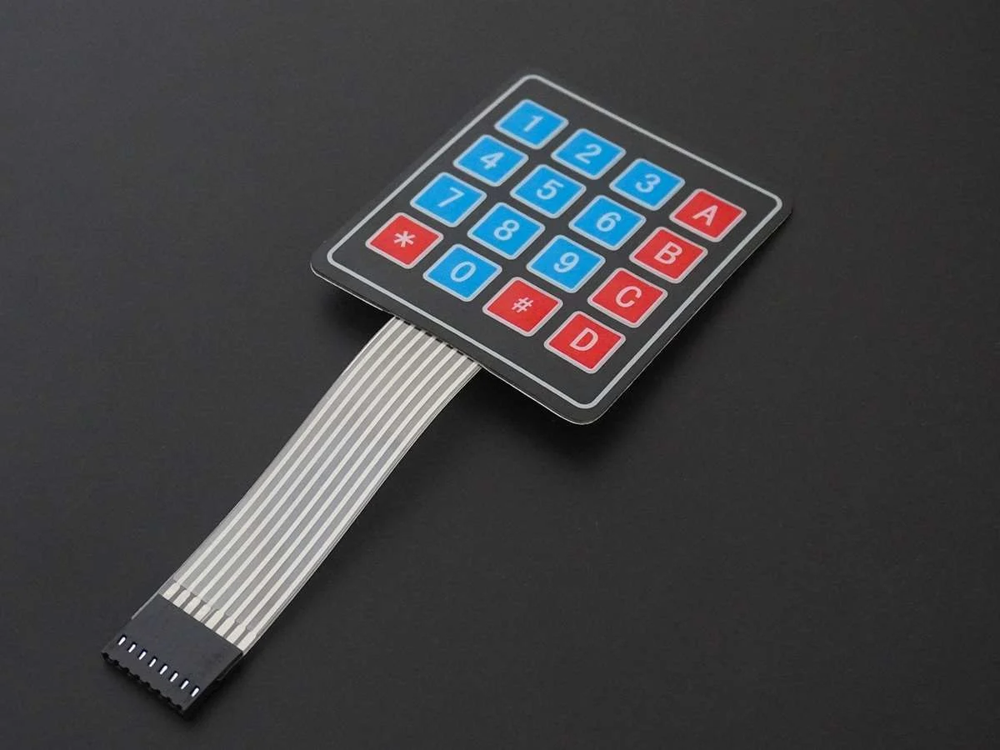
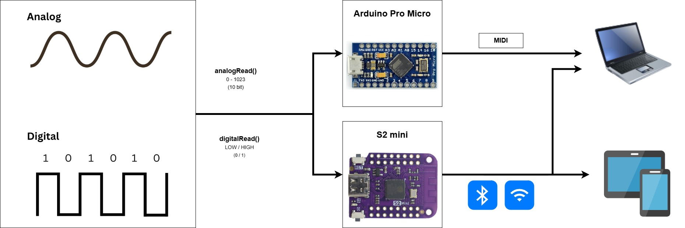

# Create your own MIDI controller from e-waste

by [@Rein](https://github.com/goudreinette) and [@Jonas](https://github.com/jwestendorp)

---

  

    
  

  

    <video src="Cabinet-00025.mp4" autoplay controls muted loop ></video>
  

  
example 3

  
example 4

## Overview

- [Requirements](#requirements)
- [Arduino code](#arduino-code)
- [Touchdesigner integration](#touchdesigner-integration)

The goal of this workshop is to make our own controller from e-waste. We will learn how to send out signals to other devices so they can be interpreted by computer programs (such as Touchdesigner).

### Signals

We can use buttons, potmeters, sensors, components, or whatever we can think of as an input for our controller.
As long as they can be interpreted as either a digital or an analog signal by Arduino it should work.

### Microcontroller

We can use
`analogRead()` and
`digitalRead()`
to interpret the signals with our microcontroller.

- #### Arduino Pro Micro

    

  We'll be using the Arduino to send out our signals as a "Human Interface Device" (HID, i.e. keyboard, mouse, gamepad). For our examples we will be using the MIDI protocol.

  **Note: not all Arduino's are capable of acting as a HID device.** Make sure to use an Arduino Leonardo, Micro or Due.

- #### S2 mini (ESP32)
    

---

## Installation

Make sure you have installed the Arduino IDE.

> **Note:** If you are using the S2 mini (ESP32) you will need to [install the ESP32 board manager](https://randomnerdtutorials.com/installing-the-esp32-board-in-arduino-ide-windows-instructions/).

---

## Components

We have prepared a small selection of components.

- button
- potmeter
- #### vape sensor
  Detects air pressure and will act as a swich when the pressure is above a certain threshold.
- touchpad
- dialpad

---

[Arduino-lessen](https://arduino-lessen.nl/)

### To-do

!!! Video of dialpad

Presentation:

- lecture on basic components
- analog vs digital (continous or discrete)
- ide setup

Prepare circuits:

- ~~button~~
- pot meter
- ~~vape sensor (mic)~~
- touchpad
- dialpad
- ???

Arduino code:

- Midi (HID device in general, i.e. keyboard)
- Bluetooth
- ? other protocols: wifi, serial

Touchdesigner integration
